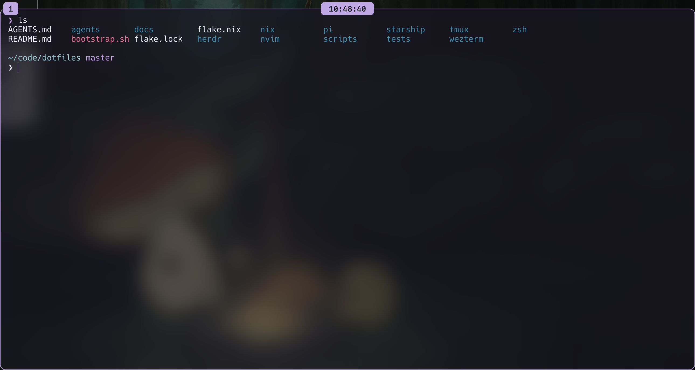

# dotfiles

This repository recreates the same terminal and editor environment on Ubuntu, Windows 11 with WSL, and macOS.
One bootstrap command installs the configured tools, activates tracked configuration, and verifies the result.



WezTerm on macOS with the floating-tabs companion enabled.
Windows and Linux use the native numbered tab bar and centered clock.

Sections:

- [Quick Start](#quick-start)
- [What the Setup Manages](#what-the-setup-manages)
- [Common Workflows](#common-workflows)
- [Repository Layout](#repository-layout)
- [Platform Limitations](#platform-limitations)
- [Personal Data and Secrets](#personal-data-and-secrets)

## Quick Start

You need an internet connection and an account that can install software.
Run the installer as your normal user, not as `root`.
Existing managed files are moved to timestamped backups before activation.

Choose the complete guide for the computer you are configuring:

- [Ubuntu installation and use](docs/ubuntu.md)
- [Windows 11 with WSL installation and use](docs/windows-wsl.md)
- [macOS installation and use](docs/macos.md)

Each guide starts from a standard platform installation and ends with version checks in WezTerm.
Native Windows without WSL is not a complete installation target because the reproducible command-line environment requires Nix.

For an already prepared machine, the central workflow is:

```sh
git clone https://github.com/dboyza/dotfiles.git "$HOME/dotfiles"
cd "$HOME/dotfiles"
./bootstrap.sh
```

The preflight reports missing prerequisites before package updates or activation begin.
Leave the computer awake until the script prints `Bootstrap complete`.

## What the Setup Manages

The shared environment includes:

- Git, Zsh, tmux, Neovim, Starship, and Herdr.
- Pi, Codex, Claude Code, and opencode.
- ripgrep, fzf, bat, btop, jq, tree, curl, wget, DNS tools, and direnv.
- Node.js, uv, pre-commit, Make, ShellCheck, and shfmt.
- kubectl and Terraform.
- Hack Nerd Font and WezTerm.
- Shared coding-agent instructions, skills, and configuration.
- Pinned tmux plugin sources.

Linux desktop installations receive WezTerm, GCC, and common X11 and Wayland clipboard tools.
WSL receives Windows WezTerm, a Windows font installation, and UTF-8-safe Windows clipboard helpers.
macOS receives WezTerm through Homebrew and system integration through nix-darwin.

Pi includes the local Calm extension, terminal-title status, model overrides, and the Rose Pine Moon theme.
Its settings declare pinned web-access, Codex fast-mode, and OpenAI server-compaction packages.
The server-compaction extension is experimental and sends relevant compaction and continuity data to OpenAI.

## Common Workflows

Application configs are symlinked to this checkout.
Edit the files here, then reload the affected application; no bootstrap is needed for ordinary config changes.
Open a new Zsh session, restart Neovim or Pi, or run `tmux source-file ~/.tmux.conf` for those tools.
WezTerm normally reloads configuration automatically.
Windows WezTerm uses a small loader pointing at the checkout instead of a copied config.

See the [shared keyboard guide](docs/keybindings.md) for cross-platform navigation, clipboard, pane controls, and prefix shortcuts.
Neovim options and mappings live in `nvim/lua/config`; plugin configuration lives in `nvim/lua/plugins`.
See the [Neovim workflow guide](docs/neovim.md) for formatting, Problems, search-and-replace, testing, debugging, terminal, and file-renaming shortcuts.
Zsh, tmux, and Neovim share the `dotfiles-clipboard` command for copy and paste.
Nix installs tmux's restoration plugins directly, so there is no separate tmux plugin manager to maintain.
tmux provides persistent terminal sessions; Herdr organizes agent workspaces within those sessions.

Keep this checkout at the same path.
Run bootstrap after moving it, adding managed paths, or changing Nix packages or system settings.
Pi can write settings and Lazy can update `nvim/lazy-lock.json` directly in the checkout, so review those changes before committing.

Codex, Claude Code, Pi, opencode, and Herdr check for the latest release whenever you launch them on macOS, Linux, WSL, and native Windows.
The first launch installs the tool; later launches update it before starting your session.
Codex, Pi, and opencode use their official npm packages; Claude Code and Herdr use checksum-verified native releases.
Updates use writable, versioned installations under `${XDG_DATA_HOME:-~/.local/share}/dotfiles/tools` on macOS and Linux or `%LOCALAPPDATA%/dotfiles/tools` on Windows, separate from the Nix store.
If a check or update fails, the launcher starts the installed version, and simultaneous launches share an update lock.
Use `DOTFILES_TOOL_UPDATE=0 codex` to skip the update check for a launch; the same variable works with all five tools.
The bypass requires a previously installed version.
To install or update without starting a session, run `node scripts/dotfiles-tool.mjs --update-only codex` from the checkout, substituting any of the five tool names.
Pi extensions remain pinned separately in `pi/settings.json`; review their compatibility when Pi updates.

Homebrew provides the remaining macOS command-line tools, including Node.js, from `nix/homebrew.nix`.
Bootstrap installs missing Brew packages without upgrading existing ones.
Nix continues to manage configuration, activation dependencies, and tmux plugins.

Read [checks, updates, testing, and recovery](docs/operations.md) before changing or repairing an installation.

To validate the pinned configuration without updating inputs or activating configuration, run:

```sh
cd "$HOME/dotfiles"
./bootstrap.sh --check
```

This command requires Nix to be installed already.

To update declared inputs and activate the configuration, run:

```sh
cd "$HOME/dotfiles"
./bootstrap.sh
```

The normal bootstrap updates Nix inputs and Windows Winget packages; macOS Homebrew installation is install-only.
It may change `flake.lock`; update existing macOS packages explicitly through Homebrew.

Run the complete local test suite with:

```sh
./tests/run.sh
```

## Repository Layout

| Path | Purpose |
| --- | --- |
| `bootstrap.sh` | Selects the platform and coordinates preflight, update, activation, and verification. |
| `scripts/lib/` | Contains shared, Linux, macOS, and WezTerm bootstrap functions. |
| `flake.nix` | Defines supported systems, packages, and platform profiles. |
| `flake.lock` | Pins Nix, Home Manager, nix-darwin, and tmux plugin revisions. |
| `nix/home.nix` | Defines portable packages and managed home files. |
| `nix/darwin.nix` | Defines macOS settings and Homebrew activation. |
| `nix/homebrew.nix` | Declares macOS command-line dependencies and the font cask. |
| `scripts/dotfiles-tool.mjs` | Checks and installs agent-tool releases at launch. |
| `agents/` | Stores shared coding-agent instructions and skills. |
| `pi/` | Stores Pi settings, model overrides, extensions, and themes. |
| `herdr/`, `nvim/`, `starship/`, `tmux/`, `wezterm/`, `zsh/` | Store application configuration. |
| `scripts/` | Contains shared clipboard dispatch, WSL transport, and Windows integration helpers. |
| `tests/` | Contains bootstrap, compatibility, platform evaluation, and integration checks. |

Add portable packages to `nix/home.nix`.
Add macOS settings to `nix/darwin.nix`, command-line packages to `nix/homebrew.nix`, and desktop applications to `nix/macos-apps.json`.
Run `./bootstrap.sh --check` before activating configuration changes.

## Platform Limitations

- Native Windows supports host integration and [optional native agent-tool launchers](docs/windows-wsl.md#optional-native-windows-agent-tools); the complete shell environment still requires WSL.
- A real Windows-to-WSL GUI and clipboard smoke test requires a Windows 11 machine.
- Apple ID data, App Store authentication, privacy permissions, and personal application data are not managed.
- Nixpkgs 26.05 is the final release supporting Intel macOS, so a future Nixpkgs upgrade may require removing that profile.
- Apple Silicon macOS receives local build and runtime validation in the primary development environment.
- Intel macOS and Linux profiles receive static Nix evaluation unless tested on matching hardware.

## Personal Data and Secrets

This repository manages intentional packages and configuration, not personal data or machine state.
It does not copy SSH keys, cloud credentials, browser profiles, project files, Apple ID data, or other secrets.
Pi authentication, trust decisions, package state, and session transcripts under `~/.pi/agent` remain untracked.
Store personal data and secrets in a separate encrypted backup.
